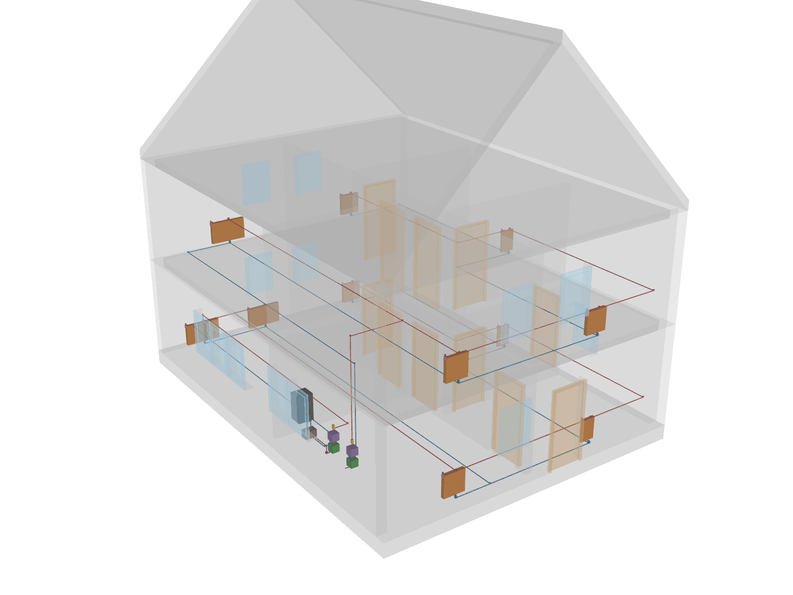
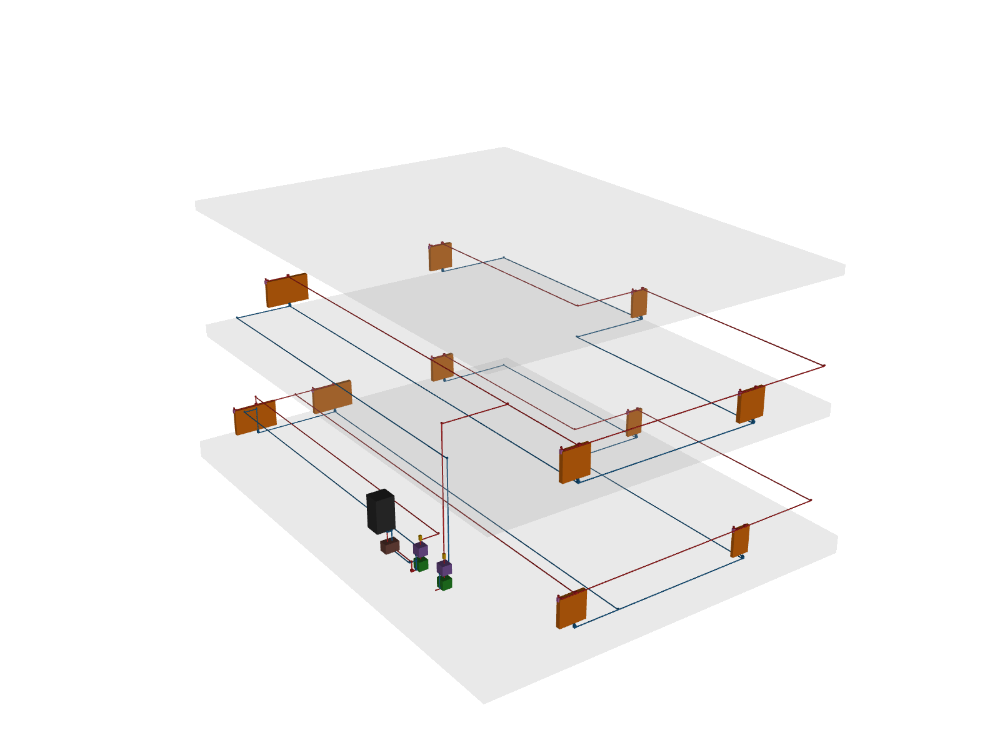
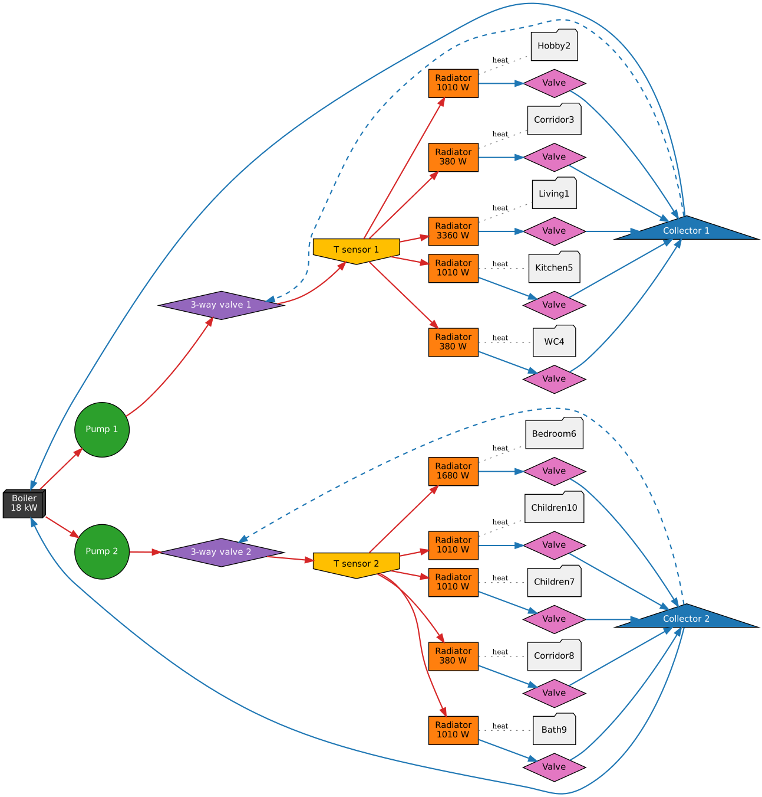

# Heating model

This tutorial shows how ifctrano translates a hydronic heating system modelled in BIM into a trano model. The example
combines two federated IFC4 models of the same house: the architecture model `ExampleHOM.ifc` and a heating discipline
model sharing its project, site, building and storeys.

The heating model follows common IFC4 MEP practice: a gas condensing boiler (`IfcBoiler`), two heating circuits
(ground floor and first floor), each with a circulator (`IfcPump`), a three-way mixing valve (`IfcValve`, `MIXING`) and
a flow temperature sensor (`IfcSensor`), and eleven panel radiators (`IfcSpaceHeater`, `RADIATOR`) with thermostatic
radiator valves. Elements are connected with pipe segments and fittings through `IfcDistributionPort`s, grouped in
supply and return `IfcDistributionSystem`s, and typed with the standard property sets
(`Pset_SpaceHeaterTypeCommon.OutputCapacity`, `Pset_BoilerTypeWater.HeatOutput`, `Pset_PumpTypeCommon.FlowRateRange`,
...).



The heating network on its own, with supply pipes in red and return pipes in blue. The boiler, circulators (green) and
mixing valves (purple) are in the kitchen; the radiators (orange) are placed in the rooms.



The heating model is generated by `tests/hvac/example_hom_heating.py` and can be written to a file with:

```bash
python -m tests.hvac.example_hom_heating ExampleHOM_heating.ifc
```

## Generate the model

The heating model is passed next to the architecture model:

```bash
ifctrano create ExampleHOM.ifc Buildings --hvac ExampleHOM_heating.ifc
```

or with Python:

```python
from pathlib import Path

from ifctrano.building import Building

building = Building.from_ifc(
    Path("ExampleHOM.ifc"), hvac_file_paths=[Path("ExampleHOM_heating.ifc")]
)
building.save_model(library="Buildings")
```

Heating elements contained in the architecture file itself are also taken into account, so single-file models work
without `--hvac`.

## What ifctrano does

1. **Network**: the port connections are turned into a directed graph. Pipes, fittings, isolating valves and sensors
   only carry connectivity; heat generators, circulators, mixing valves and radiators are the active components.
2. **Spaces**: each radiator is assigned to the space it is referenced in (`IfcRelReferencedInSpatialStructure`,
   matched by GlobalId across the federated models) or, when the model has no such relation, to the space whose
   footprint contains it.
3. **Circuits**: radiators fed by the same heat generator through the same circulator and mixing valve form a circuit.
   Each circuit becomes trano's hydronic circuit: pump, three-way valve, temperature sensor, radiators with their
   valves, and a collector returning to the boiler.
4. **Parameters**: the radiators of a space are lumped into one emitter whose nominal power is the sum of their
   `OutputCapacity` (the living room has two 1680 W radiators). The boiler power comes from `HeatOutput` and the pump
   nominal flow and head from `FlowRateRange` and `FlowResistanceRange`.

The resulting hydronic model, as generated by trano, is shown below. Supply connections are in red, return connections
in blue, and the dashed lines are the bypasses of the three-way valves.



The same information is available in the configuration generated by `ifctrano config ExampleHOM.ifc --hvac
ExampleHOM_heating.ifc`. Each heated space gets its emission:

```yaml
spaces:
- id: space_living1_v3g
  emissions:
  - radiator:
      id: radiator_space_living1_v3g
      parameters:
        nominal_heating_power_positive_for_heating: 3360.0
  - valve:
      id: valve_space_living1_v3g
      control:
        emission_control:
          id: emission_control_space_living1_v3g
```

and the boiler and circuits are described in the `systems` section (ground floor circuit shown):

```yaml
systems:
- boiler:
    id: boiler_1
    variant: without_storage
    control:
      boiler_control:
        id: boiler_control_boiler_1
    parameters:
      nominal_heating_power: 18000.0
    inlets:
    - split_valve_1
    - split_valve_2
- pump:
    id: pump_1
    control:
      collector_control:
        id: collector_control_pump_1
    parameters:
      dp_nominal: 40000.0
      m_flow_nominal: 0.25
    inlets:
    - boiler_1
- three_way_valve:
    id: three_way_valve_1
    control:
      three_way_valve_control:
        id: three_way_valve_control_1
    inlets:
    - split_valve_1
    - pump_1
    outlets:
    - temperature_sensor_1
- temperature_sensor:
    id: temperature_sensor_1
    outlets:
    - radiator_space_corridor3_n2a
    - radiator_space_hobby2_uxa
    - radiator_space_kitchen5_dsw
    - radiator_space_living1_v3g
    - radiator_space_wc4_pwg
- split_valve:
    id: split_valve_1
    inlets:
    - valve_space_corridor3_n2a
    - valve_space_hobby2_uxa
    - valve_space_kitchen5_dsw
    - valve_space_living1_v3g
    - valve_space_wc4_pwg
    outlets:
    - boiler_1
```

## Incomplete models

Real models often lack part of this information. ifctrano keeps going and records every assumption, which is logged
and available in `building.heating.assumptions`:

- a radiator not connected to a heat generator becomes an ideal emitter;
- a circuit without its own circulator or mixing valve gets the default ones of trano's circuit template;
- a missing `OutputCapacity`, `HeatOutput` or pump range falls back to trano's default value (the boiler power falls
  back to the sum of the radiators it serves);
- IFC4 has no heat-pump class: heat pumps exported as `IfcUnitaryEquipment` are recognised from their name, otherwise
  they are modelled as a boiler.

The figures of this page are generated by `docs_src/heating_figures.py`.
