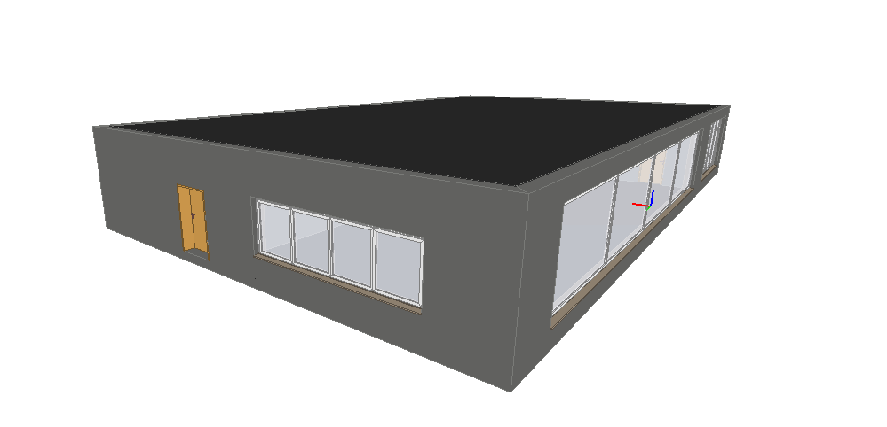
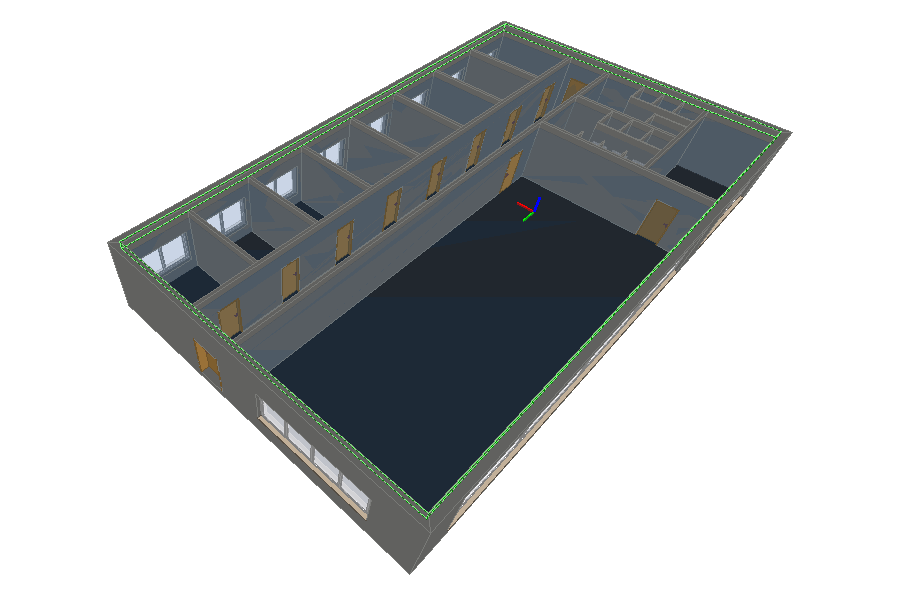
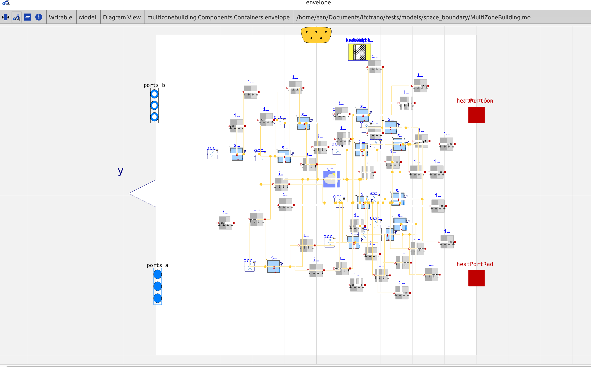
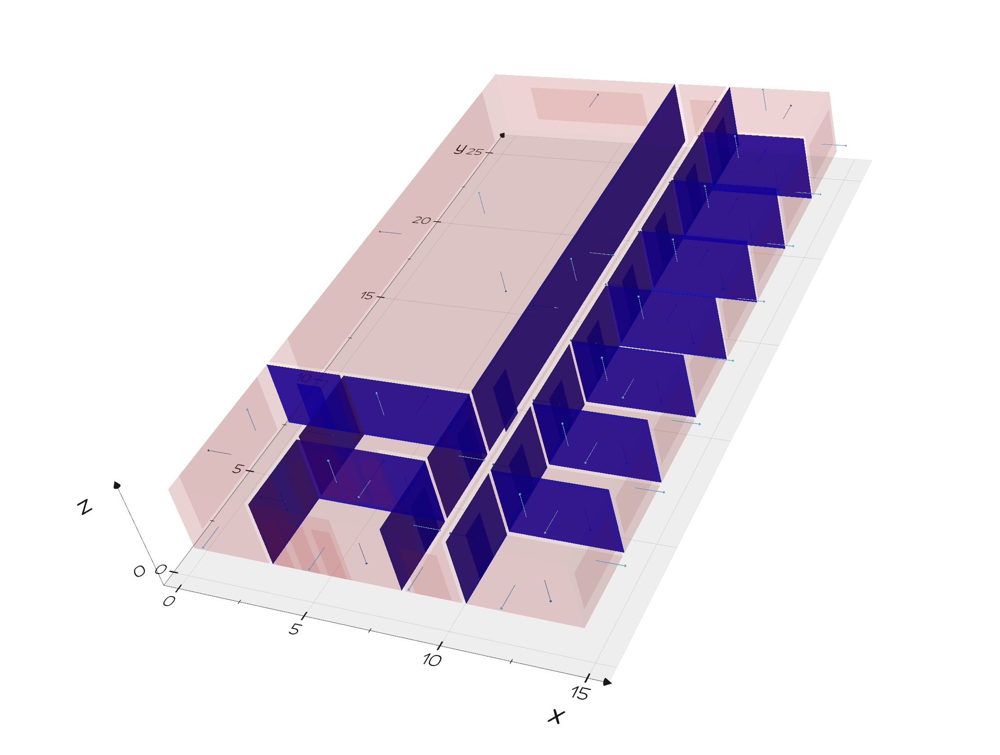
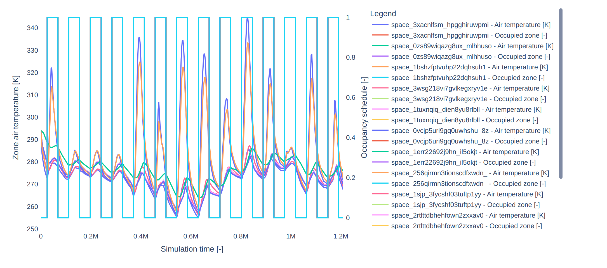

# Many zones model
This tutorial demonstrates how to generate a Modelica model and open it with OpenModelica for the multizone BIM model displayed below.





The file can be found in the repository's `tests` folder.


```python

from ifctrano.building import Building
building = Building.from_ifc(path_to_ifc_file)
building.save_model()
                
```
            

The code snippet above creates a Modelica model from the IFC file in the same folder. You can then open this model in OpenModelica.



To display the generated space boundaries alongside the Modelica model and simulate simultaneously from the command line, use the following command:


```bash
ifctrano create path_to_ifc_file.ifc --show-space-boundaries --simulate-model
```
            

The generated space boundaries will be displayed as illustrated in the figure below.



The simulation output will open automatically.



