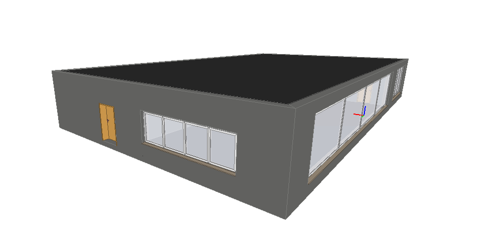
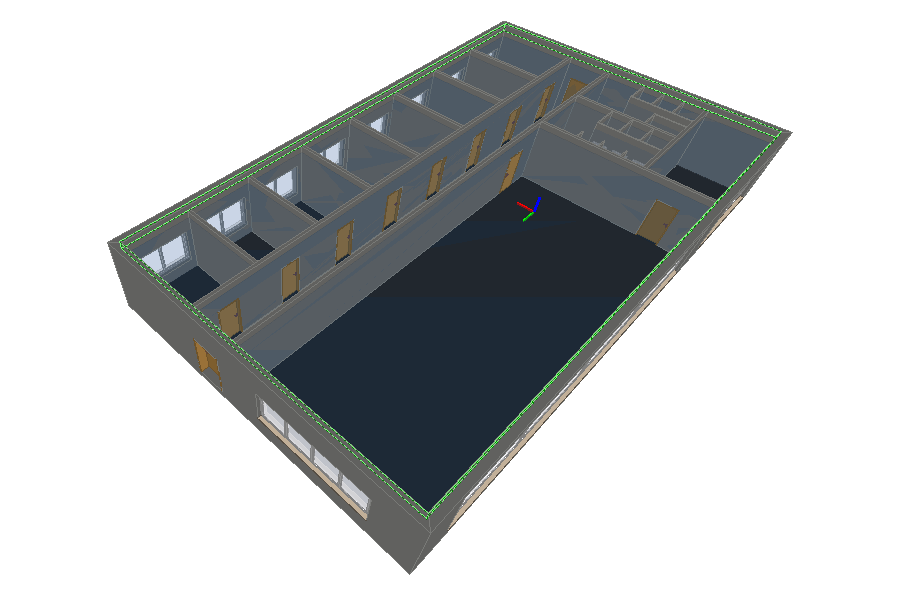

# Multizone model
This tutorial demonstrates how to generate a Modelica model and open it with OpenModelica for the two-zone BIM model shown below.





The file is located in the `tests` folder of the repository.


```python

from ifctrano.building import Building
building = Building.from_ifc(path_to_ifc_file)
building.save_model()
                
```
            

The code snippet above will create a Modelica model of the IFC file in the same folder as the IFC file. You can then open the model in OpenModelica as demonstrated below.

