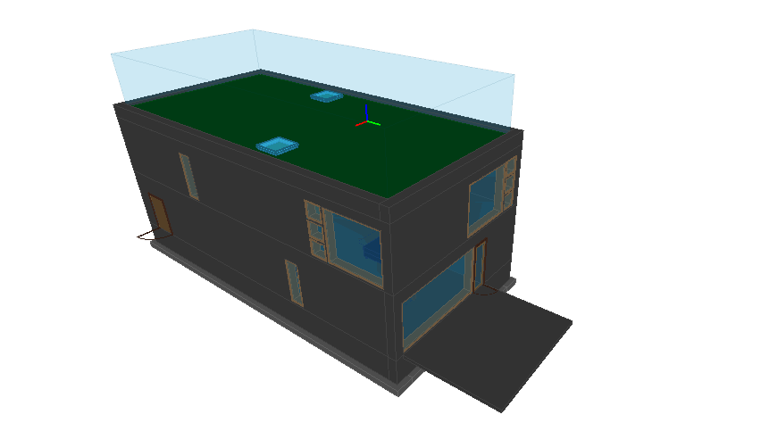
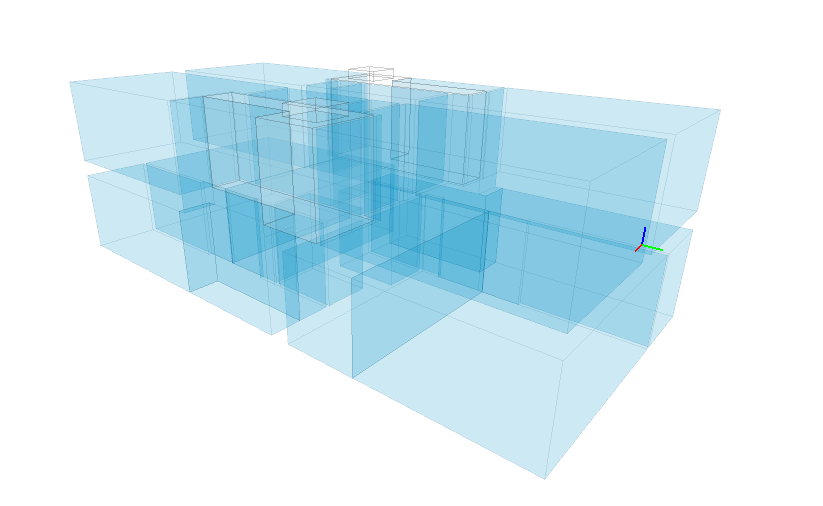
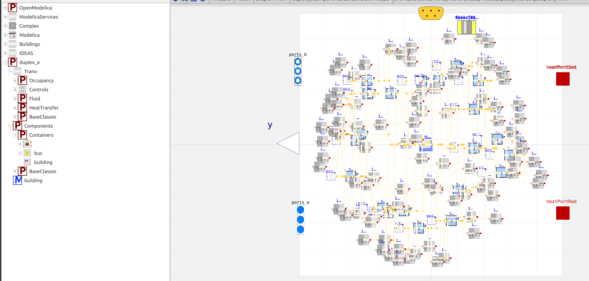
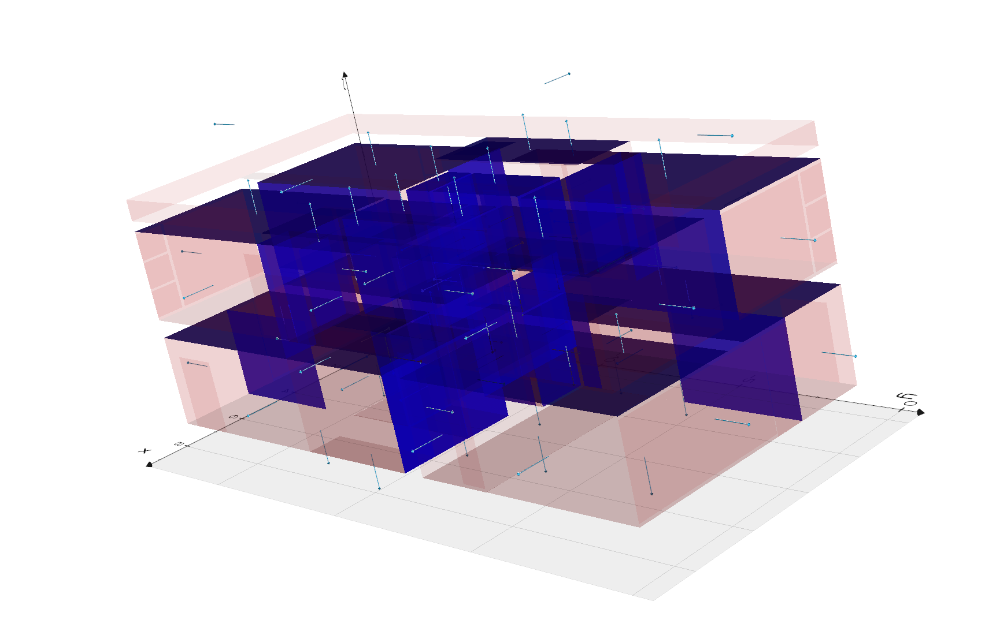
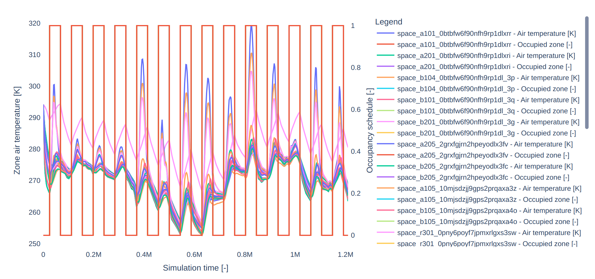

# Realistic model
This tutorial demonstrates how Ifctrano manages realistic BIM models. This example is based on the duplex apartment model available online. The model realistically represents a two-floor duplex apartment with multiple rooms, as shown in the figures below.





The file is located in the tests folder of the repository. You can use the command line interface to generate the model, as demonstrated below (similar to the previous tutorials).


```python

from ifctrano.building import Building
building = Building.from_ifc(path_to_ifc_file)
building.save_model()
                
```
            

The code snippet above generates a Modelica model of the IFC file in the same directory as the IFC file. This model can subsequently be opened in OpenModelica.



To display the generated space boundaries alongside the Modelica model and run the simulation simultaneously via the command line, use the following command:


```bash
ifctrano create path_to_ifc_file.ifc --show-space-boundaries --simulate-model
```
            

The generated space boundaries will be displayed as illustrated in the figure below.



The simulation output will automatically open in your local browser.



