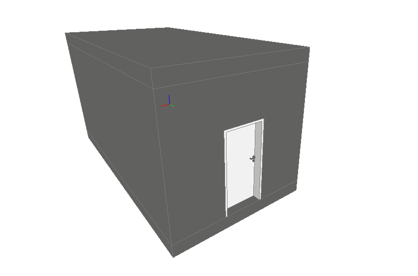
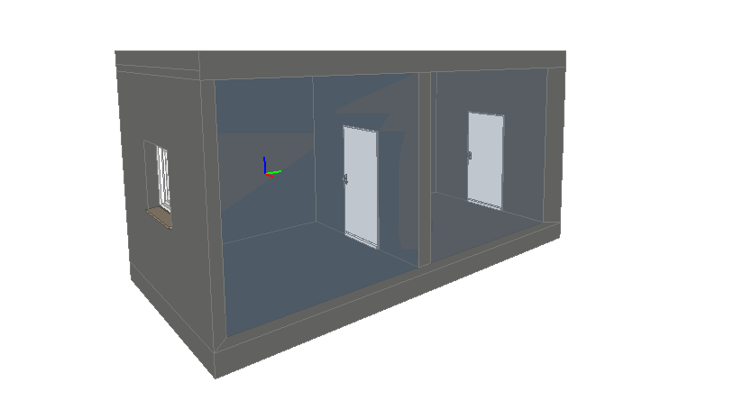
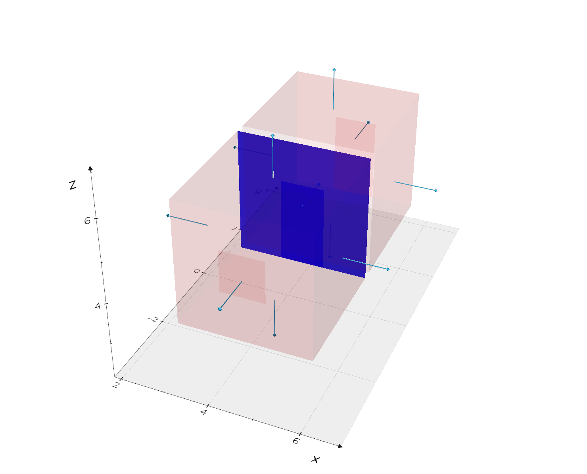
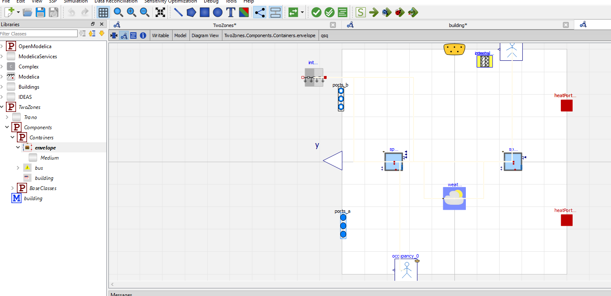
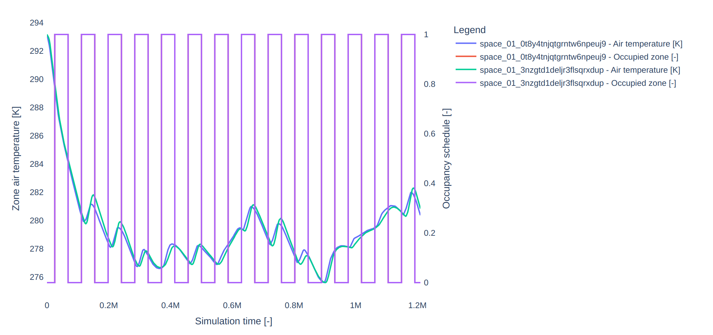

# Two zones model
This tutorial demonstrates how to generate a Modelica model and open it with OpenModelica for the two-zone BIM model shown below.





The file is located in the repository's tests folder.


```python

from ifctrano.building import Building
building = Building.from_ifc(path_to_ifc_file)
building.show()
building.save_model()
                
```
            

The code snippet above generates a Modelica model of the IFC file in the same directory. You can then open this model in OpenModelica. Use the command `building.show()` to display the generated space boundaries, as illustrated in the figure below.



Ifctrano can also be executed via the command line interface, as demonstrated below.

Run the `help` command to view the available options.


```bash
ifctrano create --help
```
            

To create a model, run the following command:


```bash
ifctrano create path_to_ifc_file.ifc
```
            

To display the generated space boundaries alongside the Modelica model, run the following command.


```bash
ifctrano create path_to_ifc_file.ifc --show-space-boundaries
```
            

This command displays the space boundary shown in the figure above.

The generated model, as shown in the figure below, can be opened in OpenModelica, provided the relevant libraries are loaded. By default, Ifctrano utilizes the Buildings library. You can open the model in OpenModelica using the following command.



Provided that Docker is installed on the host computer, Ifctrano can directly simulate the model with the following command:


```bash
ifctrano create path_to_ifc_file.ifc --show-space-boundaries --simulate-model
```
            

If the simulation is successful, the results will be saved locally, and an HTML report will be automatically generated to display key performance indicators (KPIs), as illustrated in the figure below.



