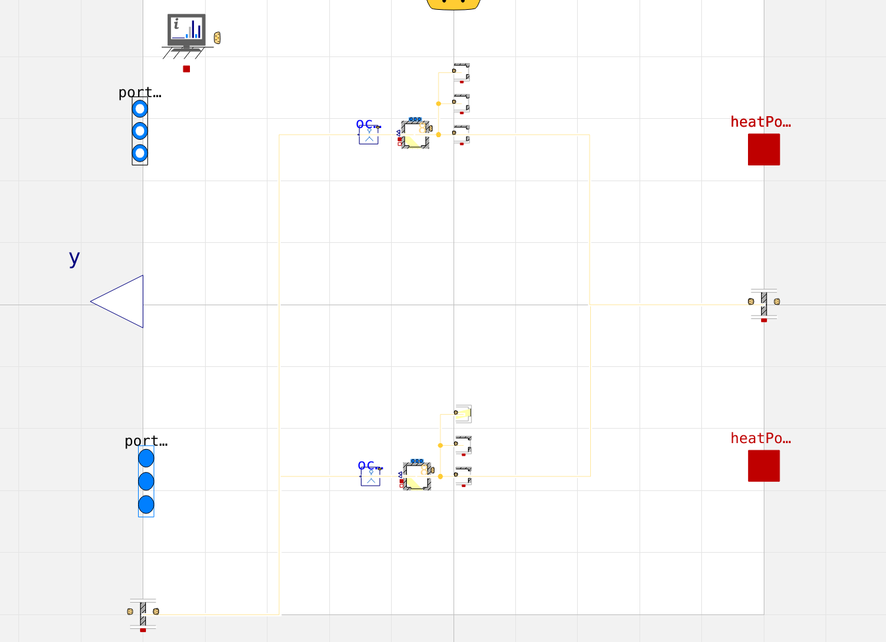

# Use different libraries
By default, ifctrano utilizes the Buildings library, but it can also integrate with other libraries. Below is an example of using additional Modelica libraries with ifctrano. 

ifctrano can generate energy models using detailed libraries like Buildings and IDEAS, as well as reduced-order models from the AIXLib library and the ISO 13790 library from the Buildings library. The following example demonstrates how to use the IDEAS library with ifctrano.


```python

from ifctrano.building import Building
building.save_model(library="IDEAS")
                
```
            

From the command line, specify the library with the `--library` option. The command below generates a model using the IDEAS library.


```bash
ifctrano create path_to_ifc_file.ifc --library IDEAS
```
            

ifctrano will rebuild the model using the IDEAS library, as demonstrated below. The generated model can be opened in OpenModelica, as shown in the screenshot below.



